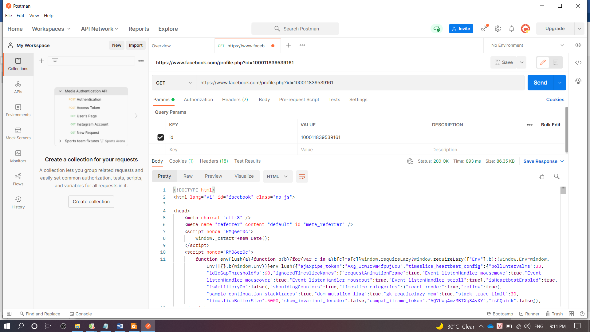
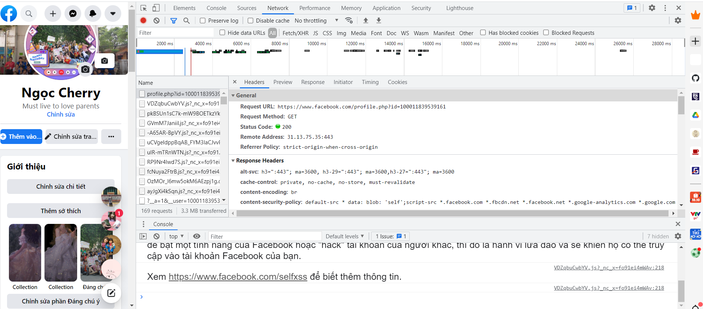

**API:** 

- là 1 tập các qui tắc cho phép các chương trình giao tiếp với nhau.
- Được developer tạo ra trên server cho phép client gọi và sử dụng nó
- là phương thức, ngôn ngữ chung để front-end, back-end hiểu nhau và trao đổi dữ liệu với nhau.
- Thường ứng dụng vào web, mobile, desktop, hệ điều hành, thư viện phần mềm, framework
- Ưu điểm: tính tự động hóa cao + khả năng tích hợp linh động + cập nhật thông tin thời gian thực
- Nhược điểm: tốn nhiều chi phí để vận hành, phát triển, chỉnh sửa + gặp vấn đề bảo mật
- Ví dụ: google dịch, ứng dụng kiểm tra nhiệt độ

**RESTful API:**

- RESTful: là 1 chuẩn dung trong việc thiết kế các API cho ứng dụng web.
- RESTful API: được xây dựng trên giao thức HTTP, sử dụng các động từ(method) HTTP để làm việc với resource (dữ liệu phía backend):

\+ put: tạo mới, cập nhật

\+ get: truy cập

\+ post: tạo mới

\+ patch: cập nhật 1 phần

\+ delete: xóa

- RESTful API: sử dụng mô hình không trạng thái và các request http độc lập, xảy ra theo bất kì thứ tự nào. Bốn thành phần chính 1 request: 

\+ endpoint(URL) mà client gửi yêu cầu lên: <https://www.facebook.com/profile.php?id=100011839539161>

\+ method (get, post, put, patch, delete)

\+ header là tiêu đề yêu cầu cung cấp thông tin cho client, server

\+ body(data) chứa tất cả thông tin client gửi cho server

- HTTP status code: yếu tố quan trọng trong http message response được server trả về cho client

\+ 2XX success

\+ 4XX client error

\+ 5XX server error

- JSON: kiểu định dạng dữ liệu chung

\+ client tương tác 1 service bằng cách trao đổi các tài nguyên dưới dạng JSON là phổ biến nhất

\+ sử dụng các cặp key – value

- Phân trang: 

\+ tránh dư thừa dữ liệu trả về, giảm lãng phí bang thông, hiệu năng 

\+ nên thiết kế API giới hạn lượng data trả về là cần thiết cho 1 request

- Versoning: 

\+ thuận tiện cho việc scale sản phẩm, phát triển API theo thời gian 

\+ có 2 cách: URL version || header version

- TIPS: 1 số nguyên tắc thiết kế chính của RESTful API sử dụng http

\+ tránh thiết kế URL phức tạp hơn mẫu collection/item/collection

\+ sử dụng danh từ (số nhiều) biểu diễn tài nguyên (resource) trên URL

\+ sử dụng – thay vì \_ để ngăn cách các cụm từ

**PRACTICE:**

Http Status code 200:  Request đã được tiếp nhận và xử lý thành công

Method GET: truy cập
